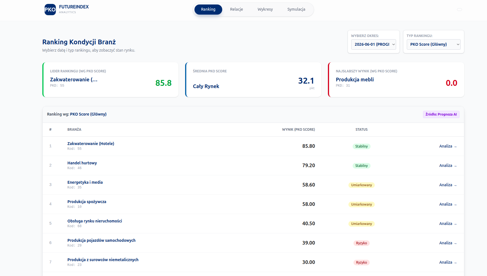
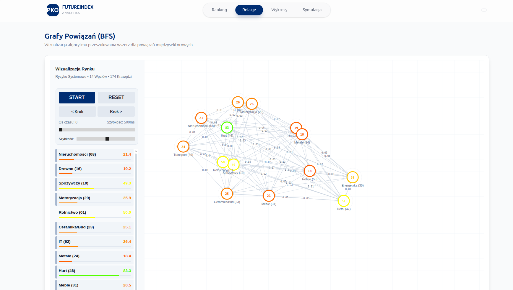
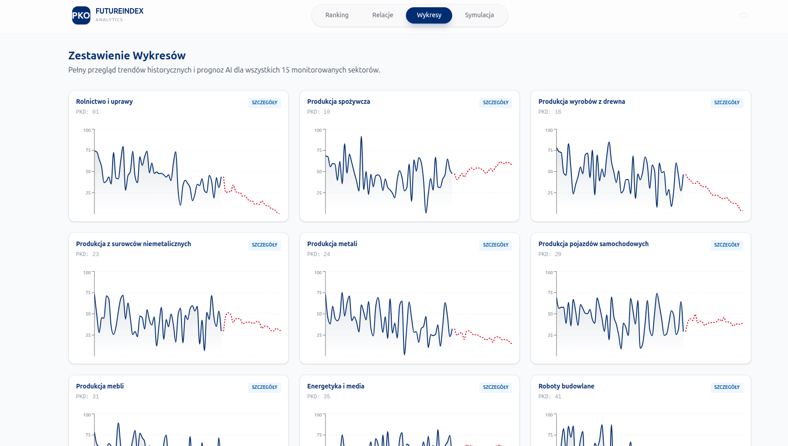
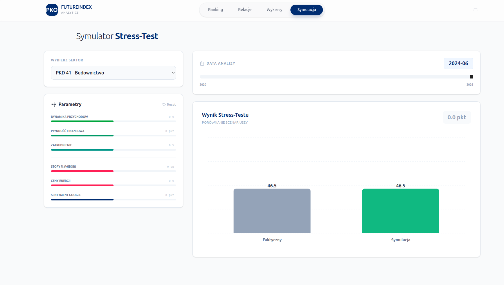

<!-- # 🏦 PKO BP Future Index (Hacknation 2025)

System analityczny oparty na AI (Prophet) i Teorii Grafów, służący do oceny kondycji branż i symulacji ryzyk systemowych.

## 🏗️ Architektura

Projekt składa się z dwóch części:

1. **Backend (Python/FastAPI):** Obliczenia, model predykcyjny, algorytm BFS.
2. **Frontend (React):** Interfejs użytkownika, wizualizacje.

## 🚀 Jak uruchomić?

### Krok 1: Backend (API)

Wymagany Python 3.9+

```bash
# Instalacja zależności
pip install fastapi uvicorn pandas numpy prophet networkx

# Uruchomienie serwera
uvicorn api:app --reload
``` -->


# Indeks branż
**Zamieszczony Program** realizuje zadanie wyznaczenia wiodących branż polskiej gospodarki. Zastosowana została symulacja rynkowa za pomocą modelu sztucznej inteligencji oraz symulacje oddziaływań rynkowych za pomocą grafów branż zależnych.

## Jak definiujemy branżę?
W naszym programie za branżę uznajemy dział gospodarki, reprezentowany przez dwie pierwsze cyfry kodu PKD. W ramach symulacji i przewidywań zastosowaliśmy próbkę 15 działów gospodarki, które uznaliśmy za reprezentatywne dla całego rynku.

## Jakie są nasze źródła danych?
Dane podzieliliśmy na dwa rodzaje:
* **Dane twarde:** pozyskane z udostępnionych zbiorów GUS (zakres lat 2007-2024), obejmujące przychody, aktywa i wskaźniki rentowności.
* **Dane miękkie:** pochodzące z analizy sentymentu (Google Trends, Yahoo Finance, wzmianki o WIBOR). Korzystamy tu z własnego algorytmu wartościowania słów kluczowych, aby ocenić nastroje wokół danej branży.

## Jakie są cząstkowe składowe indeksu?
Wykresy ukazują nie tylko aktualną (na czas ostatnich dostępnych danych) sytuację rynku, ale są również generowane przez wytrenowany model SI, który kontynuuje wykres, dokonując predykcji rozwoju na najbliższe 12-36 miesięcy.
Ostateczny ranking opiera się na trzech filarach:
1.  **Kondycja:** Obecny stan finansowy (marża, zysk).
2.  **Perspektywa:** Predykcja trendu wygenerowana przez model (wzrost/spadek).
3. **Odporność:** Wynik analizy grafowej – pozwala wykryć ryzyko systemowe i 'efekt domina' (np. upadłość w jednej branży ciągnie za sobą inne), co jest kluczowe dla bezpieczeństwa portfela kredytowego.

## Wymagania techniczne i stos technologiczny
Zgodnie z preferencjami wyzwania, rozwiązanie przygotowaliśmy w języku **Python**.
Do budowy rozwiązania wykorzystaliśmy biblioteki open-source:
* `pandas` i `numpy` do agregacji danych finansowych.
* `scikit-learn` do budowy modelu predykcyjnego i klasyfikacji branż.
* `networkx` do stworzenia grafów zależności między poszczególnymi kodami PKD.

## Sposób testowania i walidacji
Aby upewnić się, że nasz "Indeks Branż" jest wiarygodny, przeprowadziliśmy walidację na danych historycznych. Sprawdziliśmy, czy nasz model, mając dane np. tylko do roku 2020, poprawnie przewidziałby trendy, które faktycznie wystąpiły w latach 2021-2023. Wyniki te pozwoliły nam skalibrować wagi przyznawane danym miękkim i twardym.

## Kontekst wdrożeniowy
Program został zaprojektowany tak, aby działać w sposób ciągły. Aplikacja może cyklicznie zaciągać nowe dane (np. po publikacji raportów kwartalnych GUS lub zmianie stóp procentowych) i automatycznie odświeżać ranking, dając analitykom bieżący obraz ryzyka i szans w poszczególnych sektorach.

## Preview








